# VyAPI - The Modern Cloud-Based Vulnerable Hybrid Android App

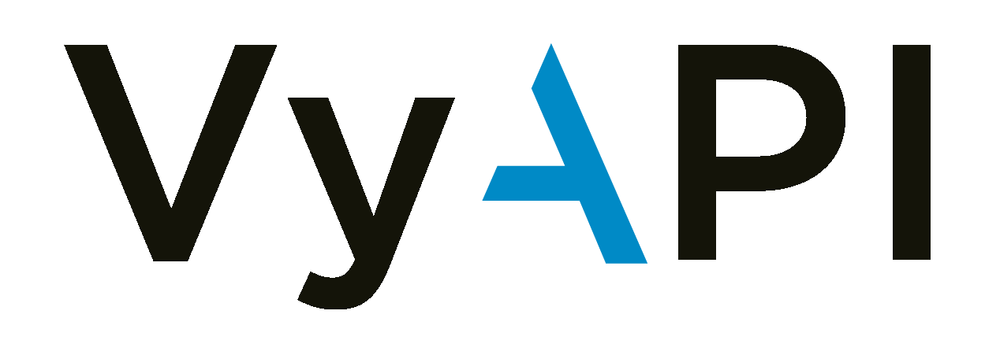

VyAPI is a vulnerable hybrid Android app that's vulnerable by design. We call it VyAPI, because it's flaws are pervasive and it communicates not just via IPC calls but API calls, too. 

[More details in our introductory blog post](https://blog.appsecco.com/vyapi-the-modern-cloud-based-vulnerable-hybrid-android-app-ee300a9d60ed)

Amazon Cognito has been used to handle authentication, authorization and user management. AWS Amplify Console has been used to consume the Authentication APIs provided by AWS Amplify Authentication module. Room persistence library has been used to handle data in the local SQLite database. Glide API has been used to load images. AndroidX libraries and JAVA programming language have been used to develop the business logic of VyAPI Android app. 

We know how to attack activities, but, what could change with fragments coming into the picture? There might be a case where we just have one activity, but multiple fragments (each rendering a different functionality) in our Android app. VyAPI will allow you to experience this behavior of our modern day Android apps.

VyAPI is different not only in terms of its look and feel, but also in terms of latest technologies being used to build it. Following primary tools and technologies have been used to develop VyAPI
1. [AWS Amplify CLI](https://aws-amplify.github.io/docs/cli-toolchain/quickstart)
2. [AWS Mobile SDK for Android 10](https://aws-amplify.github.io/docs/android/start?ref=amplify-android-btn)
3. [Amazon Cognito](https://aws.amazon.com/cognito/)
4. [OpenJDK 1.8.0_152-release](https://openjdk.java.net/install/)
5. [Glide v4](https://bumptech.github.io/glide/)
6. [Room Persistence Library](https://developer.android.com/training/data-storage/room/index.html) 
7. [Gradle 5.1.1](https://gradle.org/releases/)

Modern technologies are eliminating security risks by blocking vulnerable features by default. However, not all vulnerabilities could go away that easily. Also, with new technologies come new security vulnerabilities. Security misconfigurations, business logic flaws, and poor coding practices are evergreen vulnerabilities. VyAPI is the vulnerable hybrid Android app which can be used by our security enthusiasts to get a hands-on experience of a variety of modern and legacy Android app vulnerabilities.

## Prerequisites

1. [Node.js](https://nodejs.org/en/) (Version `8.11.X` or later)
2. [Amplify CLI](https://aws-amplify.github.io/docs/)
3. [Android Studio and SDK Tools](https://developer.android.com/studio) (for building the APK)
4. An active [AWS account](https://aws.amazon.com/) with Administrative access
5. [Android emulator](https://developer.android.com/studio/run/emulator) (API level 23 or above)

*Note:* 
The commands have been verified in a Linux environment (**Ubuntu 19.04**).

## Installation Steps (Linux)

1. Install [Amplify CLI](https://github.com/aws-amplify/amplify-cli#install-the-cli)<br/>
    ```
    sudo npm install -g @aws-amplify/cli --unsafe-perm=true
    ```
    
    *Note:* `--unsafe-perm=true` is required because of a recent issue with Amplify and [latest version of gyp](https://github.com/aws-amplify/amplify-cli/issues/1996). Ignore errors related to dependencies.

2. Check if **Amplify CLI** was installed successfully
   
    ```
    amplify status
    ```

## Amazon Cognito Setup

1. Checkout the source code from Github
   
   ```
   git clone git@github.com:appsecco/VyAPI.git
   ```

2. Enter the root directory of the cloned project.
3. Run following command to [initialize the project](https://aws-amplify.github.io/docs/cli-toolchain/quickstart) to work with the [Amplify CLI](https://github.com/aws-amplify/amplify-cli#install-the-cli)

    ```
    amplify init
    ```

    *Sample Output:*

    ```shell
    user@machine:~$ amplify init
    Note: It is recommended to run this command from the root of your app directory
    ? Do you want to use an existing environment? No
    ? Enter a name for the environment cognito
    ? Choose your default editor: Visual Studio Code
    Using default provider  awscloudformation
    For more information on AWS Profiles, see:
    https://docs.aws.amazon.com/cli/latest/userguide/cli-multiple-profiles.html
    ? Do you want to use an AWS profile? Yes
    ? Please choose the profile you want to use amplify-user
    ⠇ Initializing project in the cloud...
    CREATE_IN_PROGRESS vyapimvvm-cognito-20190909113320 AWS::CloudFormation::Stack Mon Sep 09 2019 11:33:21 GMT+0530 (India Standard Time) User Initiated             
    CREATE_IN_PROGRESS DeploymentBucket                 AWS::S3::Bucket            Mon Sep 09 2019 11:33:24 GMT+0530 (India Standard Time)                            
    CREATE_IN_PROGRESS UnauthRole                       AWS::IAM::Role             Mon Sep 09 2019 11:33:24 GMT+0530 (India Standard Time)                            
    CREATE_IN_PROGRESS AuthRole                         AWS::IAM::Role             Mon Sep 09 2019 11:33:24 GMT+0530 (India Standard Time)                            
    CREATE_IN_PROGRESS UnauthRole                       AWS::IAM::Role             Mon Sep 09 2019 11:33:24 GMT+0530 (India Standard Time) Resource creation Initiated
    CREATE_IN_PROGRESS DeploymentBucket                 AWS::S3::Bucket            Mon Sep 09 2019 11:33:25 GMT+0530 (India Standard Time) Resource creation Initiated
    CREATE_IN_PROGRESS AuthRole                         AWS::IAM::Role             Mon Sep 09 2019 11:33:25 GMT+0530 (India Standard Time) Resource creation Initiated
    ⠴ Initializing project in the cloud...
    CREATE_COMPLETE UnauthRole AWS::IAM::Role Mon Sep 09 2019 11:33:38 GMT+0530 (India Standard Time) 
    CREATE_COMPLETE AuthRole   AWS::IAM::Role Mon Sep 09 2019 11:33:39 GMT+0530 (India Standard Time) 
    ⠧ Initializing project in the cloud...
    CREATE_COMPLETE DeploymentBucket AWS::S3::Bucket Mon Sep 09 2019 11:33:45 GMT+0530 (India Standard Time) 
    ⠏ Initializing project in the cloud...
    CREATE_COMPLETE vyapimvvm-cognito-20190909113320 AWS::CloudFormation::Stack Mon Sep 09 2019 11:33:48 GMT+0530 (India Standard Time) 
    ✔ Successfully created initial AWS cloud resources for deployments.
    ✔ Initialized provider successfully.
    Initialized your environment successfully.
    Your project has been successfully initialized and connected to the cloud!
    Some next steps:
    "amplify status" will show you what you've added already and if it's locally configured or deployed
    "amplify <category> add" will allow you to add features like user login or a backend API
    "amplify push" will build all your local backend resources and provision it in the cloud
    "amplify publish" will build all your local backend and frontend resources (if you have hosting category added) and provision it in the cloud
    Pro tip:
    Try "amplify add api" to create a backend API and then "amplify publish" to deploy everything
    ```

4. Configure [Amplify CLI](https://github.com/aws-amplify/amplify-cli#install-the-cli) by running below command and following the instructions as displayed on the console

    ```
    amplify configure
    ```

    *Sample Output:*
    ```shell
    user@machine:~$ amplify configure
    Follow these steps to set up access to your AWS account:
    Sign in to your AWS administrator account:
    https://console.aws.amazon.com/
    Press Enter to continue
    Specify the AWS Region
    ? region:  us-east-1
    Specify the username of the new IAM user:
    ? user name:  amplify-user
    Complete the user creation using the AWS console
    https://console.aws.amazon.com/iam/home?region=undefined#/users$new?step=final&accessKey&userNames=amplify-user&permissionType=policies&policies=arn:aws:iam::aws:policy%2FAdministratorAccess
    Press Enter to continue
    Enter the access key of the newly created user:
    ? accessKeyId:  A**********************
    ? secretAccessKey:  p*************************************
    This would update/create the AWS Profile in your local machine
    ? Profile Name:  amplify-user
    Successfully set up the new user.
    ```

    *Note:*
    * It requires you to **login** into the **AWS Management Console**. 
    * You need to create a **new user** and obtain the corresponding Access Key ID and Secret Access Key values.
    * If you wish to reuse an existing user, skip the user creation step and press enter to enter the access key of an **existing user**.

5.  Run the following command to add authentication resource in your local backend: 
    ```
    amplify add auth
    ```
    *Sample Output:*
    ```shell
    user@machine:~$ amplify add auth                          
    Using service: Cognito, provided by: awscloudformation
    
        The current configured provider is Amazon Cognito. 
        
        Do you want to use the default authentication and security configuration? Default configuration
        Warning: you will not be able to edit these selections. 
        How do you want users to be able to sign in? Username
        Do you want to configure advanced settings? No, I am done.
        Successfully added resource vyapicbc9b00d locally

        Some next steps:
        "amplify push" will build all your local backend resources and provision it in the cloud
        "amplify publish" will build all your local backend and frontend resources (if you have hosting category added) and provision it in the cloud
    ```

6. Check the state of local resources not yet pushed to the cloud

    ```
    amplify status
    ```
    
    *Sample Output:*
    ```shell
    user@machine:~$ amplify status
    
    Current Environment: cognito
    | Category | Resource name     | Operation | Provider plugin   |
    | -------- | ----------------- | --------- | ----------------- |
    | Auth     | vyapimvvm59909b03 | Create    | awscloudformation |
    ```


7. Push the local changes to cloud

    ```
    amplify push
    ```

    *Note:* Please be patient while this command runs, as it would take a few minutes to complete.

8. Open the project in Android Studio. 
9.  Generate the VyAPI APK by selecting `Build Bundle(s)/ APK(s)` -> `Build APK(s)` in Android Studio

    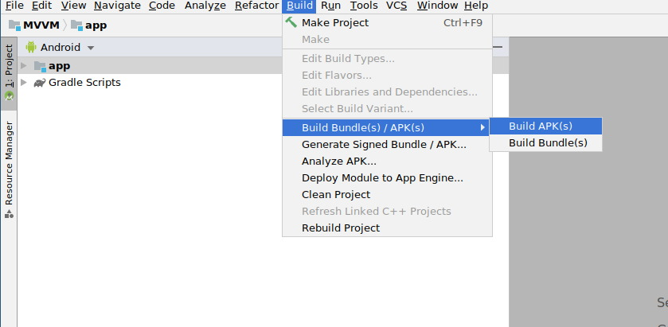

10. Obtain the VyAPI APK from the relative path `app/release/app-release.apk`

    

11. Create an [Android Emulator](https://developer.android.com/studio/run/managing-avds). 
    
    *Note:* The emulator used during the development of VyAPI had following configuration

    

12. Install the VyAPI APK (obtained from step #11, above) into the Android Emulator by running the following command

    ```
    adb install app-release.apk
    ```

## Getting Started


14. Start the VyAPI app to see the Amazon Cognito login screen

    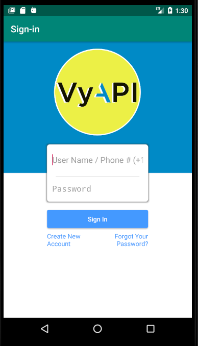

15. Click on the Create New Account button and fill the user registration form.

    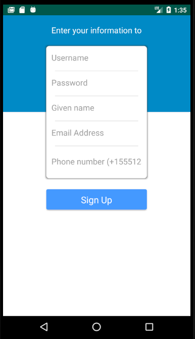

    *Note:* 
    * Enter a valid email ID  
    * Enter 10 digit phone number preceded by plus symbol and two-digit country code (e.g., +915544332211)
    * Confirmation code would be sent to your registered email address

16. Retrieve the confirmation code from your inbox and paste it into the `Confirmation code` input box of **Confirm your account** page

    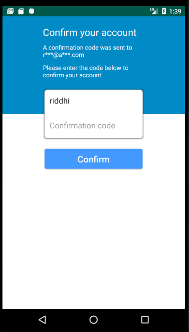

17. Wait for the **Sign up confirmation** message to show up

    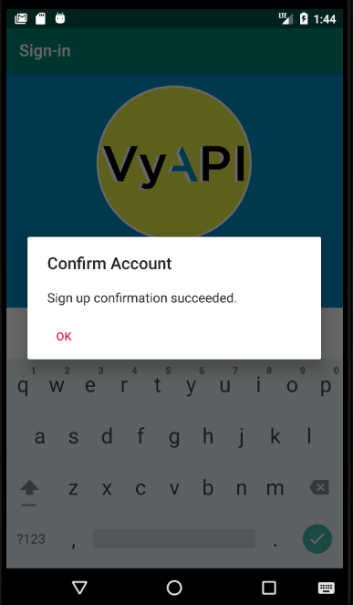

18. Login with the registered username and password

    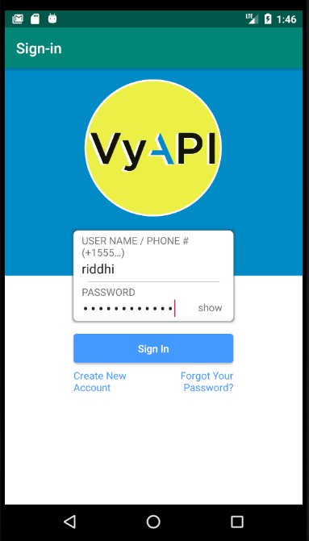

19. On successful login, you would see the empty contacts page

    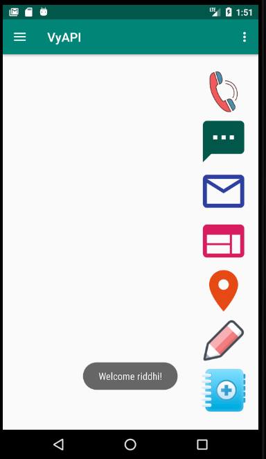

    On this screen, you can do following
    * Create a new contact
    * Edit an existing contact
    * Select an existing contact and 
      * Call the user 
      * Send SMS 
      * Send email 
      * Open user's website 
      * Open user's location in Google Maps
    * Delete an existing contact by swiping the selected contact in right or left direction

20. Access the **Navigation Menu** to see other available options

    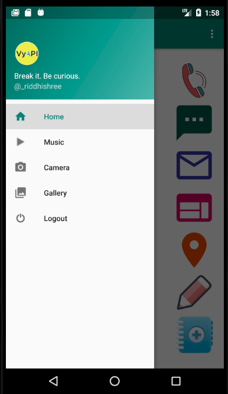

21. Play some music

    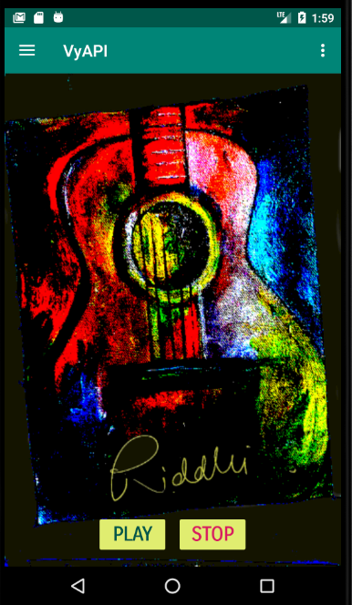

22. Click some pictures

    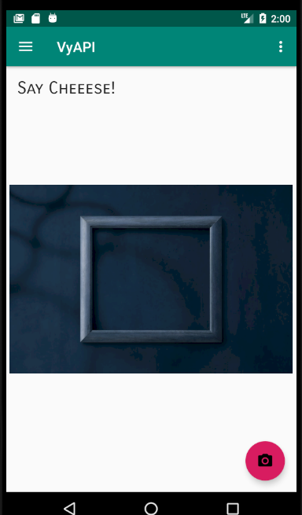

23. View clicked pictures in the gallery

    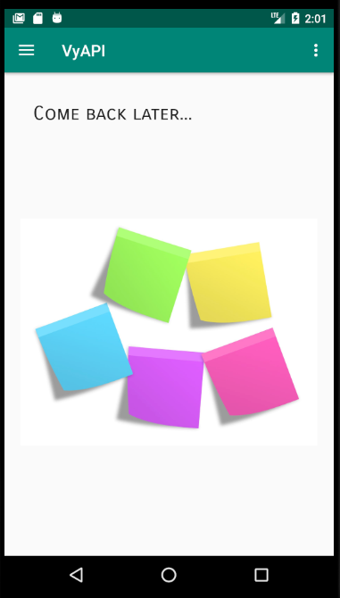

24. Explore the remaining features and vulnerabilities. 

## Blog Posts

* [Presenting a modern cloud based vulnerable Android app - VyAPI](https://blog.appsecco.com/vyapi-the-modern-cloud-based-vulnerable-hybrid-android-app-ee300a9d60ed)
* [The Story of how I made a vulnerable Android App VyAPI](https://blog.appsecco.com/vyapi-the-story-of-a-vulnerable-hybrid-android-app-aee44f6d1f2d)

## How to contribute

In case of bugs in the application, please create an issue on github. Pull requests are highly welcome!

## Thank You!

* [@makash](https://github.com/makash): For guiding and encouraging me to explore my interest area
* [@riyazwalikar](https://github.com/riyazwalikar) and [Gwilym](https://uk.linkedin.com/in/gwilymlewis): For helping me with VyAPI logo design 
* [@suneshgovind](https://github.com/suneshgovind): For helping me with the documentation and picture editing
* [madhuakula](https://github.com/madhuakula): For prompt feedback and helping with Ops tasks  
* [yamakira](https://github.com/yamakira) and [abhisek](https://github.com/abhisek): For their feedback, suggestions and encouragement
* Ayush Gaurav: For his creative inputs while editing the image used on vulnerable service screen
* Special thanks to people whom I met through their blogposts and/or their helpful responses on stackoverflow.com, and who's work helped me clarify my concepts and, ultimately, allowed me to turn my imagination into a working model.

## Reference Links

* [Reference Links](app/src/main/java/com/appsecco/vyapi/misc/references.md)

## License

[MIT](LICENSE)
